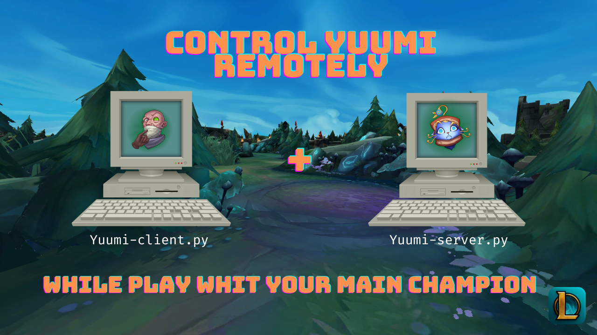

# LoL Yuumi Remote Control
LoL Yuumi Remote Control is a Python project that allows you to control a Yuumi character in the game League of Legends remotely from another computer. The project consists of two scripts: the Yuumi client and the Yuumi server. The client script runs on the computer you're using to play with your main champion, while the server script runs on the computer that's playing.

This project was created based on the need to play as Singed in a duo with a Yuumi player. It can also be used to control Yuumi in the bot lane while you play as a top laner, for example.

## Functionality

The Yuumi client script listens to mouse and keyboard events, and when the "Yuumi enable controls" key is pressed, it sends requests to the Yuumi server script to perform actions in the game. The following actions are currently supported:

- Casting spells (Q, W, E, R, D, F)
- Clicking the left or right mouse button
- Leveling up abilities
- Opening the shop
- Opening the scoreboard
- Going to the base

The Yuumi server script receives these requests and uses Python libraries like `keyboard` and `pyautogui` to perform the actions in the game. The script is configured to work with a specific screen resolution, which can be set in the `config.ini` file.

## Configuration

Before running the scripts, make sure to configure the IP address of the Yuumi server computer in the `config.ini` file. You can also adjust the screen resolutions and key bindings in the file. The following options are available:

### General Options

- `yuumi_server_ip`: The IP address of the computer running the Yuumi server script.
- `yuumi_server_port`: The port number that the Yuumi server script is listening on.
- `client_game_resolution`: The resolution of the computer running the Yuumi client script.
- `yuumi_game_resolution`: The resolution of the computer running League of Legends.
- `yuumi_controls_key_press_duration`: The duration (in seconds) that a key should be pressed to perform an action in the game.

### Keys

- `spell_q`: The key that should be pressed to cast the Q spell.
- `spell_w`: The key that should be pressed to cast the W spell.
- `spell_e`: The key that should be pressed to cast the E spell.
- `spell_r`: The key that should be pressed to cast the R spell.
- `spell_d`: The key that should be pressed to cast the D spell.
- `spell_f`: The key that should be pressed to cast the F spell.
- `open_shop`: The key that should be pressed to open the shop.
- `tab_info`: The key that should be pressed to open the scoreboard.
- `go_to_base`: The key that should be pressed to go to the base.
- `level_up_q`: The key that should be pressed to level up the Q ability.
- `level_up_w`: The key that should be pressed to level up the W ability.
- `level_up_e`: The key that should be pressed to level up the E ability.
- `level_up_r`: The key that should be pressed to level up the R ability.
- `yuumi_enable_controls_key`: The key that should be pressed to enable Yuumi controls.

## Requirements

The following Python libraries are required to run the scripts:

- `flask`
- `keyboard`
- `pynput`
- `pyautogui`
- `pywin32`

## Running the Scripts

To run the Yuumi client script, run the following command:

```bash
python yuumi-client.py
```

To run the Yuumi server script, run the following command:

```bash
python yuumi-server.py
```

## Inspiration

This project was inspired by my own need to control Yuumi remotely while playing Singed.

